<div align="center">

# Meeting Notes

### On-device meeting notes and dictation for macOS

**One app instead of Granola, Wispr Flow and Cluely.**<br>
Transcribe and summarise any call live, get help and tips while you're on it, ask questions about every call you've had, and hold a hotkey to type or edit by voice in any app.

[](https://github.com/lucassynnott/meeting-notes/releases/latest)


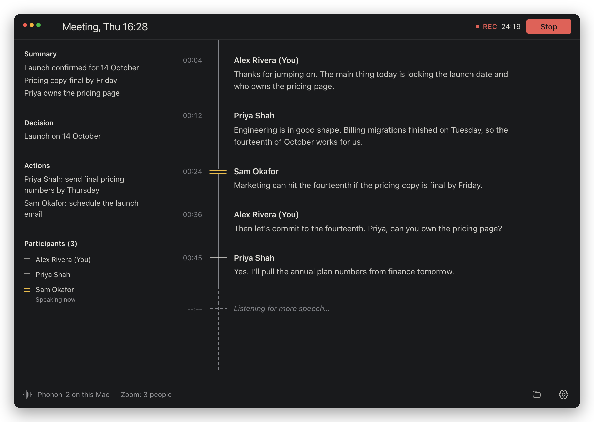

[Install](#install) · [Why](#one-app-instead-of-three) · [Features](#features) · [Tour](#a-look-around) · [Calls](#how-it-works) · [Dictation](#dictation) · [Models](#transcription-models) · [Notion](#save-calls-to-notion) · [Privacy](#privacy) · [Development](#development)

</div>

---

## One app instead of three

| You'd use | For | Meeting Notes does it with |
|---|---|---|
| **Granola** | Meeting notes | Live on-device transcription of calls in any app, speakers told apart by voice, your own notes filled in from the transcript, a running summary with decisions and action items, prep cards before calls, a speaking coach, action items you tick off, and answers to any question about past calls |
| **Cluely** | Live AI help during calls | Ask during a call by typing or quietly out loud, press a shortcut for suggestions from what's just been said, and get tips on their own when one would help. Answers draw on the call so far, what's shared on screen, your playbooks and earlier calls with the same people |
| **Wispr Flow** | Speech to text anywhere | Hold a hotkey in any app and speak: the text is cleaned up, matched to the app's style and typed where your cursor is. Select text and say what to change to rewrite it |

Everything runs on one shared on-device model, so there's no monthly subscription and your audio never leaves your Mac. The AI parts (notes, Ask, live help, tips, prep, digests, drafts, AI cleanup) use your own [OpenRouter](https://openrouter.ai) key, so only text goes to the model you pick, or run fully **offline** on a model on your Mac. See [Privacy](#privacy) for exactly what.

## Features

**Calls**

<table>
<tr><td width="30%">🎙️ <b>Live, on-device transcription</b></td><td>Phonon-2 or Parakeet transcribe while you talk, entirely on your Mac. Download models with one click.</td></tr>
<tr><td width="30%">📹 <b>Records any call</b></td><td>Auto-record for Zoom, Google Meet, Microsoft Teams, Slack huddles, FaceTime, Webex, Discord, WhatsApp, Signal, Telegram and more, in the app or the browser. It starts a few seconds into the call and stops when it ends.</td></tr>
<tr><td width="30%">👥 <b>Speaker names</b></td><td>Your side is labelled with your name. Other people are told apart by voice on your Mac (Speaker 1, Speaker 2…); name someone once and later calls recognise them. Zoom calls use Zoom's names and teach the app those voices. Each speaker gets their own colour.</td></tr>
<tr><td width="30%">📝 <b>Notes as the call unfolds</b></td><td>A running summary, decisions and action items with owners. Type your own notes during the call, and each line is filled in from the transcript afterwards.</td></tr>
<tr><td width="30%">🧭 <b>Live help</b></td><td>Ask during a call: “what should I ask next?”, “how do I handle that objection?”, “sum up the call so far”. Answers come from the call so far, your knowledge base and earlier calls with these people, in a couple of glanceable lines. Type it, or hold Right ⌘ and ask quietly; your spoken question is kept out of the transcript. Press Right ⇧ + Right ⌘ for instant suggestions from what's just been said.</td></tr>
<tr><td width="30%">💡 <b>Tips during calls</b></td><td>Now and then a short tip pops up on its own, only when it would help: a question you haven't answered, an objection your playbook covers, or something you promised last time. Rarely, sometimes or often, and off for a call with one click. It never shows while you share your screen in Zoom.</td></tr>
<tr><td width="30%">🖼️ <b>See what was shared</b></td><td>When someone shares slides or a document, each new one is saved with its text (read on your Mac). The notes get a Shared on screen section with the images, live help knows what's on screen, and the images go into the Notion page too.</td></tr>
<tr><td width="30%">📚 <b>Knowledge base</b></td><td>Point it at folders of your own documents (sales playbooks, call scripts, product notes, training transcripts in Markdown, PDF, Word and more), and connect MCP servers you already use, like Linear, Notion, a wiki or CRM, with a browser sign-in or an access token. Live help, Ask, tips and prep cards use them and cite the source. Folders are read and searched on your Mac.</td></tr>
<tr><td width="30%">📅 <b>Calendar</b></td><td>Calls take their calendar event's name and list who was invited. Two minutes before a call, a prep card recaps your last calls with those people (or the last two of a repeating call) and what's still open, with an Open Zoom & join button.</td></tr>
<tr><td width="30%">✉️ <b>Follow-ups and digests</b></td><td>One click drafts the follow-up email or Slack message. Every Friday afternoon a weekly digest sums up the week's calls, decisions and open action items.</td></tr>
<tr><td width="30%">🧑‍🤝‍🧑 <b>In-person meetings</b></td><td>Put your Mac on the table and choose In person: everyone in the room is told apart by voice from the microphone alone. Your own voice is learned from your calls, so your lines get your name.</td></tr>
<tr><td width="30%">⏭️ <b>Back-to-back calls</b></td><td>Start your next call while the last one's notes are still being written; each finishes in the background.</td></tr>
<tr><td width="30%">🗂️ <b>Save to a folder, Notion or Google Drive</b></td><td>Every call becomes a Markdown note, a page in a Notion database, or both, and optionally a Google Doc in a Drive folder you choose.</td></tr>
</table>

**Your calls, afterwards**

<table>
<tr><td width="30%">🏠 <b>Home</b></td><td>Your week at a glance: calls per day, time in calls, words spoken and your share of the talking, words dictated and typing time saved, your open action items to tick off, who you met, your speaking coach, and today's calendar.</td></tr>
<tr><td width="30%">📚 <b>Meetings</b></td><td>Every past call with its notes and transcript. Search everything, rename calls, file them in folders and tag them, and rename speakers.</td></tr>
<tr><td width="30%">✅ <b>Action items</b></td><td>Tick them off on Home, in each meeting, or on the Action items page: yours or everyone's, open or done, with search. Ticking updates the note itself, so Obsidian and your AI apps see it too (the Notion page isn't changed). Send any item to <b>Linear</b>, a <b>Notion</b> task database or <b>Apple Reminders</b>, or send yours automatically after each call.</td></tr>
<tr><td width="30%">🎯 <b>Speaking coach</b></td><td>For every call: your share of the talking, pace, filler words, questions asked, how often you talked over someone, your longest stretch, and one tip. Home shows the week.</td></tr>
<tr><td width="30%">💬 <b>Ask your meetings</b></td><td>Ask “What did I promise Priya?” and get an answer that links to the calls it came from. Ask about everything, one folder or one meeting, from the Meetings page or out loud from any app with Right ⌘.</td></tr>
</table>

**Dictation**

<table>
<tr><td width="30%">⌨️ <b>Dictate anywhere</b></td><td>Hold a hotkey (fn, Right ⌥, F5, Home… anything), speak, and the text is typed into whatever field you're in, or copied if there isn't one.</td></tr>
<tr><td width="30%">✨ <b>Cleanup and style</b></td><td>Fillers and stutters are removed on your Mac. AI cleanup also applies your corrections (“Tuesday, no wait, Wednesday”) and matches the app: casual in Slack, professional in Mail, exactly as said in code editors.</td></tr>
<tr><td width="30%">✏️ <b>Edit by voice</b></td><td>Select text in any app, hold Right ⌥ + Right ⌘ and say “make this shorter” or “translate to Spanish”. The selection is rewritten in place.</td></tr>
<tr><td width="30%">📖 <b>Your dictionary</b></td><td>Teach it names and words it mishears; they're fixed in dictation, transcripts and notes.</td></tr>
<tr><td width="30%">🧩 <b>Snippets</b></td><td>Say “my calendar link” or “my address” and get the full text, exactly as you saved it.</td></tr>
<tr><td width="30%">🤫 <b>Whisper mode</b></td><td>Dictate under your breath in a quiet office: quiet speech is boosted before it's transcribed.</td></tr>
<tr><td width="30%">🕘 <b>History</b></td><td>Everything you dictate or rewrite by voice, searchable on the Dictation page, so nothing is lost if it landed in the wrong window.</td></tr>
</table>

**And**

<table>
<tr><td width="30%">🔌 <b>Works with your AI apps</b></td><td>A built-in MCP server lets Claude, Claude Code and Cursor search your calls, action items and knowledge base, and a <code>meeting-notes</code> command does the same in Terminal. Read only.</td></tr>
<tr><td width="30%">🧭 <b>Guided setup</b></td><td>A two-minute setup where you try dictation and Edit by voice, practise with the speaking coach, pick your shortcuts and connect your calendar and knowledge base.</td></tr>
<tr><td width="30%">🚀 <b>Always ready</b></td><td>Opens at login if you like, waiting in the menu bar as a small waveform that shows a glowing red dot while it records. Updates install themselves.</td></tr>
<tr><td width="30%">✈️ <b>Offline mode</b></td><td>Run every AI feature on your Mac with Gemma 4 instead of OpenRouter: nothing leaves your Mac, it's free, and it works without internet. Notes are shorter than a large cloud model's.</td></tr>
<tr><td width="30%">🔒 <b>Local by default</b></td><td>Audio, notes and voice prints stay on your Mac. No accounts, telemetry or analytics.</td></tr>
</table>

## A look around

**Home.** Your week at a glance: calls, time in calls, words spoken and your share of the talking, words dictated, your open action items to tick off, who you met, your speaking coach, and today's calendar with Join buttons.

<p align="center">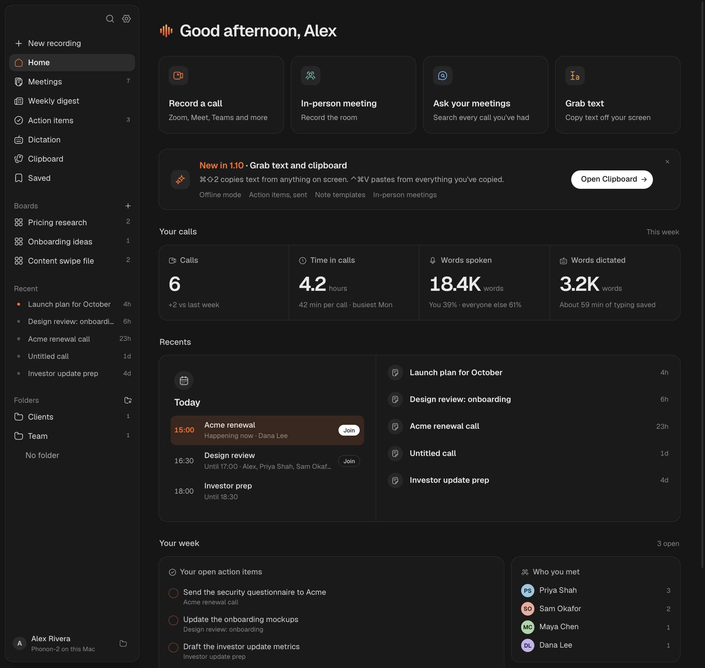</p>

**Meetings and Ask.** Every past call with its notes and transcript. Ask a question in plain English and the answer lists the calls it came from, each with an Open meeting note button.

<p align="center">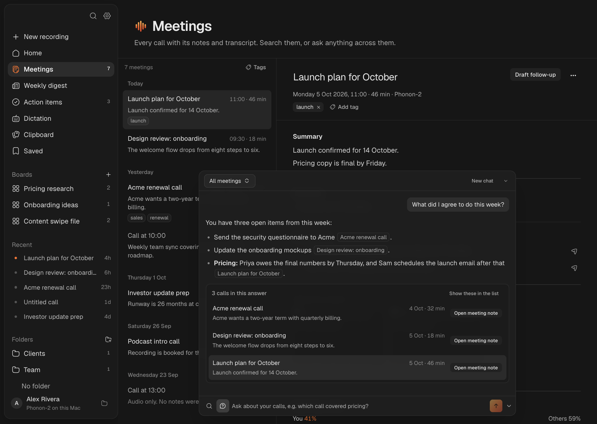</p>

**Prep before calls.** Two minutes before a call, a card recaps your last calls with those people (or the last two in a repeating series) and what's still open. Open Zoom & join takes you straight into the meeting. The same card answers questions you ask out loud with Right ⌘.

<p align="center">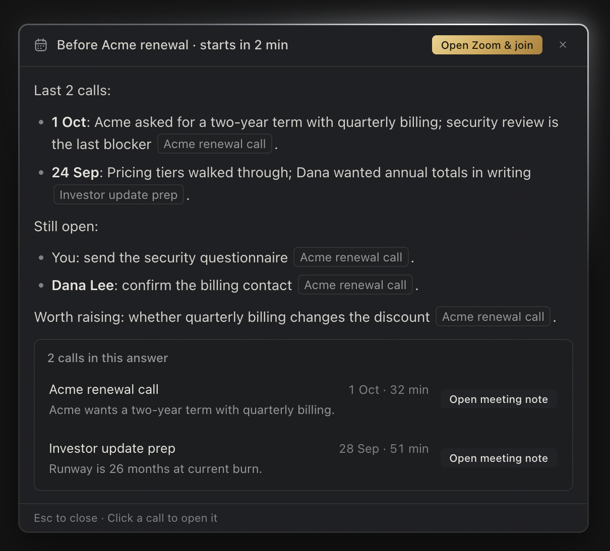</p>

**Tips during calls.** Only when it would help, a short tip appears above the pill. Here, a promise from last call that just came up again. More asks live help for the details.

<p align="center">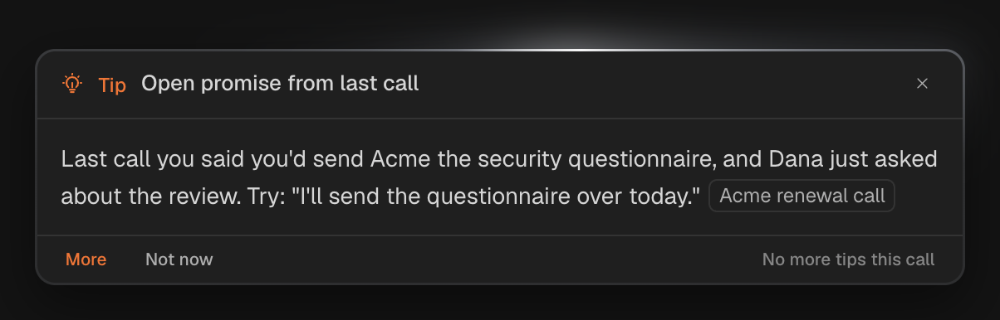</p>

**Speaking coach.** Every call shows your share of the talking, pace, filler words, questions asked, how often you talked over someone and your longest stretch, with one tip. Its action items have tick boxes too.

<p align="center">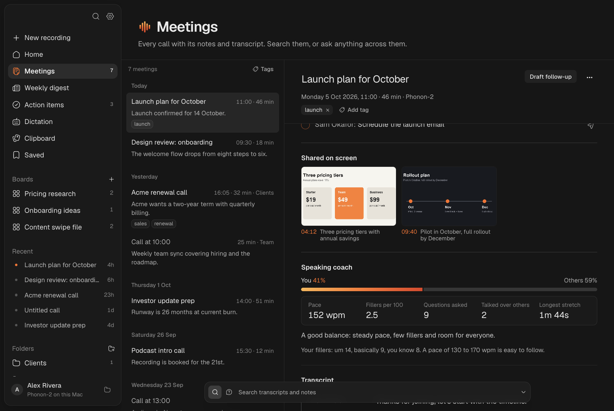</p>

**Action items.** Every action item from your calls, grouped by call. Yours or everyone's, open or done; tick them off as you go.

<p align="center">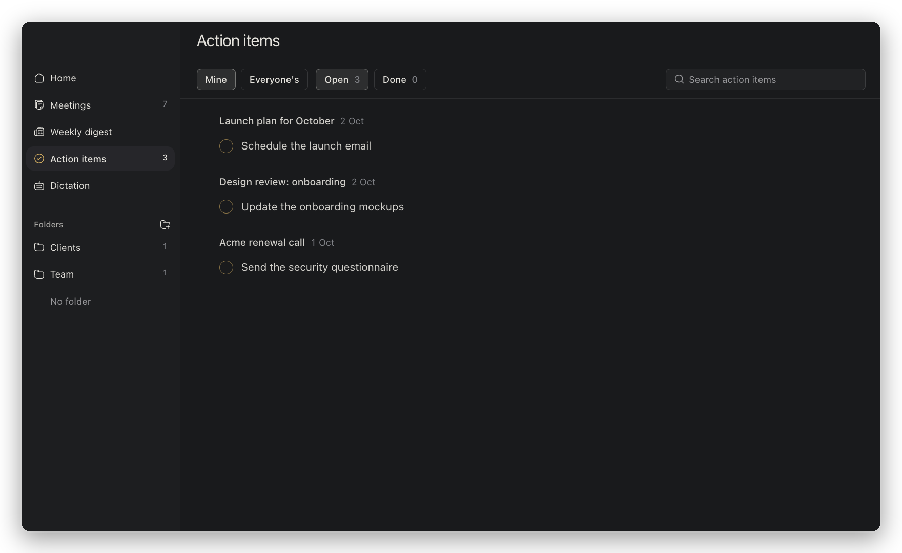</p>

**Weekly digest.** Every Friday afternoon: the week in brief, decisions, open action items with yours first, and everyone you met, each linked to its call.

<p align="center">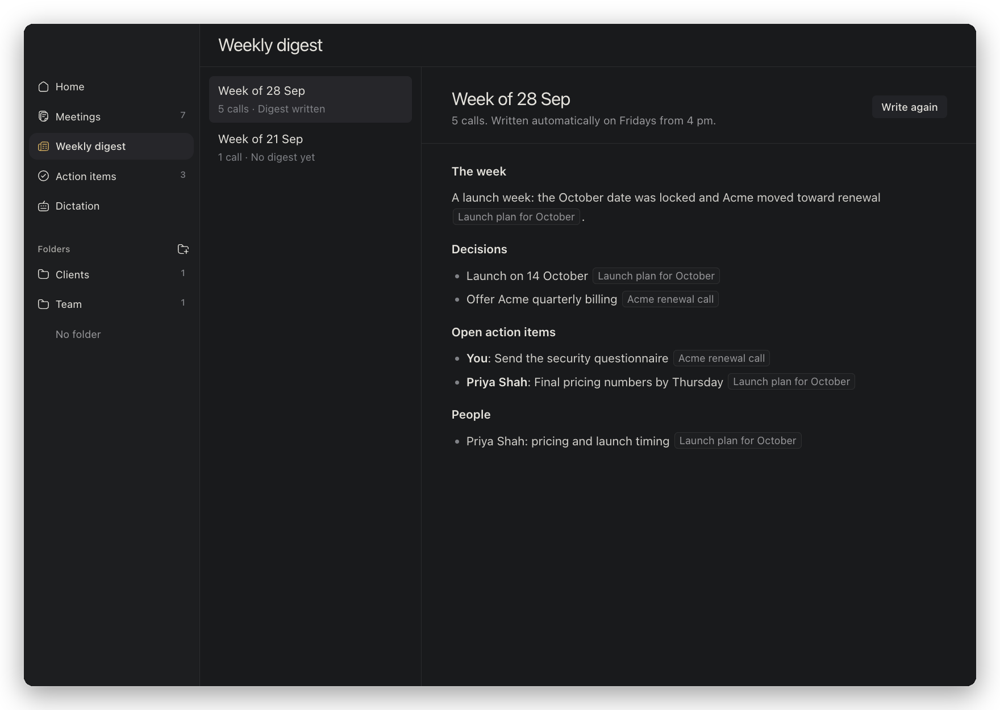</p>

**Knowledge base.** Folders of your own documents, plus connected sources: MCP servers like your wiki or docs, signed in once. Their answers are cited like any document.

<p align="center">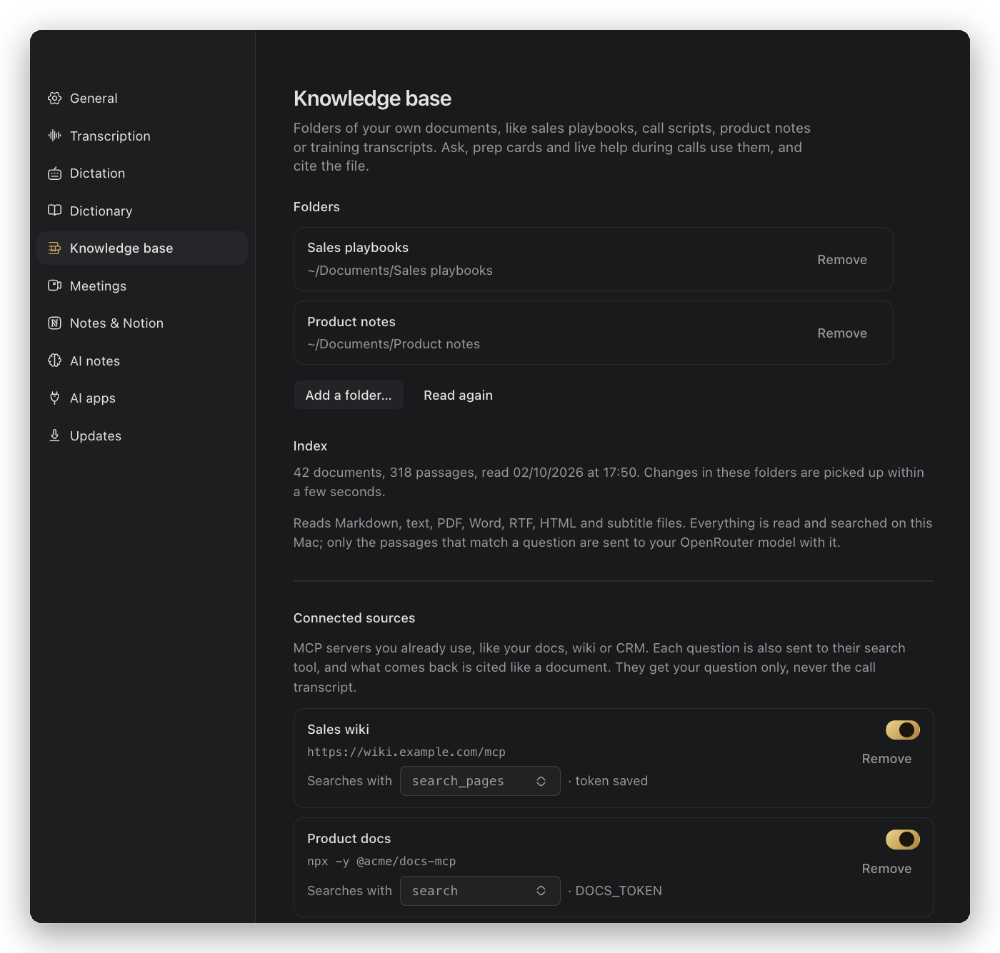</p>

## Install

> **Requires** an Apple Silicon Mac on macOS 14.4 or later.

1. Download **`Meeting-Notes-<version>-arm64.dmg`** from the [latest release](https://github.com/lucassynnott/meeting-notes/releases/latest) and drag **Meeting Notes** into Applications.
2. The app is signed with a Developer ID but **not notarized**. The first time you open it, right-click **Meeting Notes** in Applications, choose **Open**, then **Open** again.
   <sub>If macOS still refuses: `xattr -dr com.apple.quarantine "/Applications/Meeting Notes.app"`</sub>
3. A short welcome window walks you through the rest in a few minutes: your name, the **Microphone**, **Screen & System Audio Recording** and **Accessibility** permissions (each explained when it's asked for, with a microphone level check), downloading a transcription model, an optional [OpenRouter](https://openrouter.ai) key for AI notes, where notes go (a folder, Notion or both), your calendar and knowledge base, and dictation. You try dictation and Edit by voice on the spot, set all four shortcuts, and practise a short talk with the speaking coach. You can reopen it any time from the waveform in the menu bar: **Welcome & Setup…**

**Updates are automatic.** Meeting Notes checks for a new version every few hours, downloads it in the background and installs it the next time you restart the app. It never restarts during a call. **Settings → Updates** shows your version and has **Check for updates** and **Restart to update**. Copies older than 1.4.0 need this one download by hand; after that they update themselves.

## How it works

1. **Start recording**, or let it start on its own when a call begins in Zoom, Meet, Teams, Slack, FaceTime or another call app. The waveform in the menu bar gets a glowing red dot while it runs, and the sidebar shows **Recording**.
2. Your microphone and the Mac's system audio are recorded together and transcribed separately, so your words are always labelled with your name. The other side is told apart by voice, or named by Zoom.
3. Live notes refresh during the call, and you can type your own notes beside them. Ask live help anything, press Right ⇧ + Right ⌘ for suggestions, and tips pop up when one would help. If calendar access is on, the call takes its event's name.
4. When it ends, Meeting Notes tidies the speaker labels, fills in your notes, works out your speaking coach, and writes `YYYY-MM-DD-HHMM.md` (title, your notes, summary, decisions, action items and the full transcript) next to the `.webm` audio. It saves to Notion too if you've turned that on. Calls saved only to Notion keep a local copy, so they still appear on the Meetings page.

<details>
<summary><b>Recording calls automatically</b></summary>

- Turn it on in **Settings → Meetings → Record calls automatically**.
- **Zoom** is read through Accessibility: recording starts 2.5 seconds after Zoom shows an active meeting with someone in it, carries on through screen sharing, and stops 5 seconds after the meeting and sharing windows have gone.
- **Other apps** are noticed when they start using your microphone: Microsoft Teams, Slack huddles, FaceTime, Webex, Discord, WhatsApp, Signal, Telegram, Tuple, Around, GoTo, RingCentral and Amazon Chime.
- **Browser calls** (Google Meet, Teams, Zoom, Whereby, Jitsi and Webex in Chrome, Safari, Arc, Helium and others) count once the browser uses the microphone while showing the meeting tab. Switching tabs afterwards keeps the recording going.
- A call ends 15 seconds after its app lets go of the microphone, so a brief drop doesn't split the recording. Native apps also count as still in the call while they play call audio, so muting doesn't stop it.
- Automatic recordings only stop on their own; recordings you start yourself never stop when an app closes. Pressing **Stop** pauses automation until that call ends.

</details>

<details>
<summary><b>Speaker names</b></summary>

- **You:** the microphone you choose in **Settings → General** (the system default or a named input, with a level test).
- **Zoom:** a small native observer reads participant names and the active-speaker indicator from the macOS Accessibility tree. A segment is named only when one speaker clearly dominates it.
- **Everyone else:** each stretch of the other side's speech gets a voice print (a [WeSpeaker](https://github.com/wenet-e2e/wespeaker) model run with [sherpa-onnx](https://github.com/k2-fsa/sherpa-onnx), downloaded once, 26 MB). Prints that sound alike become Speaker 1, Speaker 2… and are tidied when the call ends.
- **Naming people:** click a speaker on the Meetings page and type who it is. The whole note is updated and their voice is remembered, so later calls name them. Voices from Zoom calls are learned automatically. A known name is only used when the match is clear; otherwise it stays Speaker 2.
- **Settings → Meetings** lists known voices with a Forget button. Voice prints can't be turned back into audio.

</details>

<details>
<summary><b>Calendar, prep cards and the weekly digest</b></summary>

- Turn on **Settings → Meetings → Name calls from your calendar**. It reads the Calendar app on your Mac, including Google and Outlook accounts added in System Settings, so macOS asks for Calendar access once.
- A recording takes the name of the event it falls in (one with a call link, other attendees or a meeting-like title) and the note lists who was invited. Their names help the AI spell them and are suggested when you name a speaker.
- **Prep cards:** about two minutes before a call with people you've met, a card recaps your last calls with them and what's still open. For a repeating event it recaps the last two calls in the series. **Open Zoom & join** opens Zoom straight into the meeting; Meet and Teams links open those. First calls stay quiet.
- **Weekly digest:** on Fridays from 4 pm the week's calls are summed up on the **Weekly digest** page, with a copy in a `Weekly digests` folder beside your notes, where `[[call]]` links open each call's note in Obsidian.

</details>

## Dictation

Speech to text anywhere on your Mac, like Wispr Flow, but transcribed on-device. Turn on **Settings → Dictation**, then hold the shortcut anywhere on your Mac, speak, and let go. A small pill at the bottom of the screen shows that it's listening. Your words are then:

- **typed into the text field you're in**: the app pastes with ⌘V and then restores whatever was on your clipboard before; or
- **copied to the clipboard** when no text field is focused (or it's a password field). The pill says so.

| Setting | Options |
|---|---|
| Shortcut | Any key or combination: fn, left or right ⌘ ⌥ ⌃ ⇧ on their own, F1–F20, Home, End, Page Up/Down, Ins, Del, letters, Space… Click **Change…** and press it. |
| Mode | **Hold to talk** (release to insert) or **Press to start, press again to insert** |
| Clipboard | Optionally keep the dictated text on the clipboard after pasting |

- **Cancel:** Esc cancels a dictation. A modifier-only shortcut such as Right ⌥ is cancelled automatically when you use it in a normal shortcut (Right ⌥+2 still types €), and taps shorter than 0.3 s are ignored.
- **Model:** dictation uses the transcription model selected below and keeps it loaded while dictation is on, so text appears about half a second after you let go. Phonon-2 uses about 1.1 GB of memory while loaded.
- **Terminals:** apps that draw their own text (Terminal, iTerm2, Warp, Ghostty and others) are always pasted into.
- **Using fn on its own:** set **System Settings → Keyboard → Press 🌐 key to** “Do Nothing” so macOS doesn't also open the emoji picker.
- **Permissions:** dictation needs **Accessibility** (to see the shortcut and paste) and **Microphone**.

**Clean up, style and your dictionary.** **Light** cleanup removes ums and stutters on your Mac. **AI** cleanup also applies your corrections ("Tuesday, no wait, Wednesday") and fixes punctuation in about half a second, falling back to Light if it's slow. With AI on, **Style by app** makes dictation casual in chat apps, professional in email, and exactly as said in code editors and terminals, where spoken symbols become characters ("dash b" becomes `-b`). You can add your own apps. **Settings → Dictionary** holds names and words it mishears, with what they're often heard as, and **snippets**: phrases like “my calendar link” that are replaced with your saved text (AI cleanup never rewrites it).

**Whisper mode** (Settings → Dictation) lowers the silence threshold and boosts quiet speech, for dictating under your breath. **Dictation history** keeps what you dictate and rewrite on your Mac (never password fields), searchable on the **Dictation** page with one-click copy; turn it off or clear it any time.

**Three more shortcuts**, set in **Settings → Dictation** or during setup:

| Shortcut | Default | Does |
|---|---|---|
| Ask | Right ⌘ | Ask a question about your meetings out loud. The answer appears in a card above the pill, with links to the calls it used. Esc closes it. |
| Edit | Right ⌥ + Right ⌘ | Rewrite the selected text in any app by saying what to change. The text is read from the selection, or copied with your clipboard put back. |
| Live help | Right ⇧ + Right ⌘ | During a call: suggestions from what's just been said, in the same card. |

<p align="center">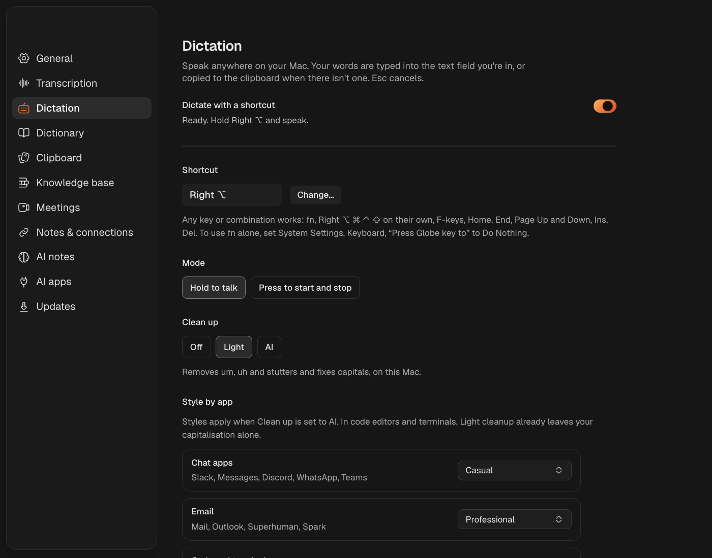</p>

## Transcription models

Pick a model in **Settings → Transcription model**. Each card has **Download**, **Use** and **Remove** buttons. A download shows a progress bar, can be cancelled, and resumes where it stopped. The menu bar's **Transcription Model** submenu switches between installed models.

| Model | Languages | When | Size |
|---|---|---|---|
| **Phonon-2** | English | Live | ~1.2 GB* |
| Parakeet TDT 0.6B v3 | 25 European | Live | 670 MB |
| Parakeet TDT 0.6B v2 | English | Live | 661 MB |
| Whisper large-v3 turbo | 99 | After call | 574 MB |
| Whisper base.en | English | After call | 148 MB |

<sub>* Including its Python runtime. Whisper models also need `brew install whisper-cpp ffmpeg`.</sub>

**Phonon-2** from [Fermion Research](https://www.fermionresearch.com/research/phonon-2/) is a 164 MB compressed Parakeet TDT model that runs on the Apple Silicon GPU with MLX. It loads in about 12 s, then transcribes each speech segment in under 0.1 s.

<p align="center">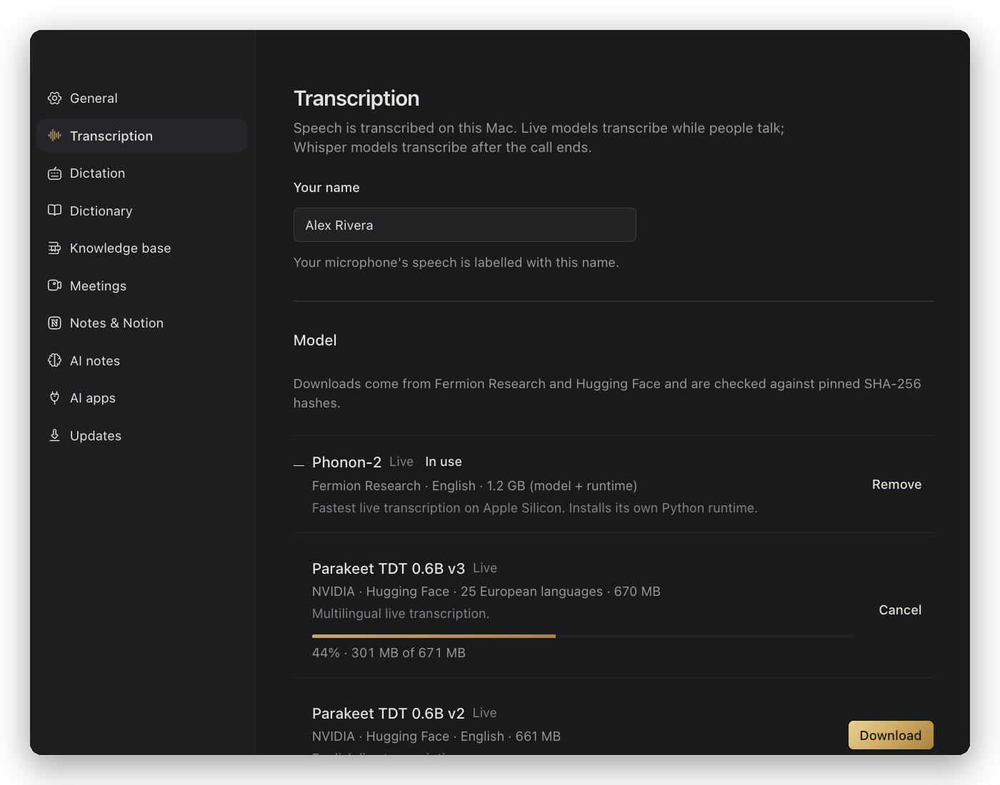</p>

<details>
<summary><b>Download and install details</b></summary>

- Hugging Face models (`istupakov/parakeet-tdt-0.6b-v3-onnx`, `istupakov/parakeet-tdt-0.6b-v2-onnx`, `ggerganov/whisper.cpp`) are pinned to a commit and checked against SHA-256 hashes. They're moved into `~/Library/Application Support/MeetingNotes/models` only once complete.
- Phonon-2 installs itself. A pinned standalone `uv` (downloaded if you don't have it) provides Python 3.13 and the `fermion-research` runtime in `~/Library/Application Support/MeetingNotes/phonon-venv`. While recording, the app runs `fermion serve phonon-2` on a private Unix socket.
- Models installed another way are detected too:
  - a `fermion` CLI set with `FERMION_BIN`;
  - Parakeet folders from the Handy app;
  - whisper.cpp models set with `WHISPER_MODEL` or in standard locations.
- Optional Groq or OpenAI Whisper keys in `.env` enable cloud transcription after the call. Leave them out to keep transcription local.

</details>

## Save calls to Notion

After each call, Meeting Notes adds it as a page in a Notion database. The page has the summary, decisions, action items (as checkboxes) and the full speaker-labelled transcript. If you typed your own notes, they come first. It also gets these properties: **Date**, **Duration (min)**, **Source**, **Action items**, **Transcription** and **Summary model**.

Pages are named after the call (its calendar event or an AI-written title), and **Source** says how it started, such as Manual or Google Meet auto.

In **Settings → Notes & Notion**, choose **Notion** or **Both**, then sign in one of two ways. Neither needs a terminal.

| | **Connect Notion** | **Log in to Notion via Composio** |
|---|---|---|
| Uses | The official [Notion CLI](https://ntn.dev) (`ntn`) | The [Composio CLI](https://composio.dev) and your Composio account |
| First-time download | 5 MB from Notion, if `ntn` isn't installed | 110 MB from GitHub, if `composio` isn't installed |
| Sign-in | Your browser opens Notion; check the code matches | Your browser opens Composio, then Notion to allow access |

Downloads show a progress bar and are checked against a pinned SHA-256 before they run. Once you're signed in, pick an existing database or let Meeting Notes create **Call Transcripts** in a page you choose. You can switch between the two sign-ins later with **Use Composio instead** / **Use the Notion CLI instead**.

Each page is created in a single request, so a failed save never leaves a half-written page. A local ledger prevents duplicates and queues failed saves, which are retried when the app starts and after the next call.

## Permissions

| Permission | Why | Required |
|---|---|---|
| Microphone | Records your voice, and dictation | Yes |
| Screen & System Audio Recording | Records other participants via system audio, and saves slides shared in a call (if that's on) | Yes |
| Accessibility | Reads Zoom participant names and the active speaker, browser window titles to spot meeting tabs, and lets the dictation, Ask, Edit and live help shortcuts work and paste. It never clicks or controls other apps. | For Zoom names, browser calls and the shortcuts |
| Calendars | Names calls after their event, lists attendees, prep cards and Home's calendar | Only if you turn on the calendar |

If macOS remembers an old permission, quit Meeting Notes, toggle its entry off and on in **System Settings → Privacy & Security**, and reopen it.

## Use with Claude, Cursor and Terminal

Open **Settings → AI apps**:

- **Command line tool** installs `meeting-notes` in `~/.local/bin`:

  ```sh
  meeting-notes search acme pricing          # calls that mention it, with the matching passages
  meeting-notes list --from 2026-09-01 --folder Clients
  meeting-notes show 2026-10-01-1605         # one call's notes and transcript
  meeting-notes actions --owner priya        # open action items
  meeting-notes kb objection handling        # your knowledge base
  meeting-notes mcp                          # the MCP server, on stdio
  ```

- **Claude Desktop** and **Cursor**: **Connect** adds Meeting Notes to their MCP servers (the previous config is kept as a `.bak`). For **Claude Code**, copy the `claude mcp add` line shown there. Any other MCP app takes the JSON shown there.
- The server offers `search_meetings`, `list_meetings`, `get_meeting`, `get_action_items` and `search_knowledge`. It only reads. It runs as the app's own binary in Node mode (`ELECTRON_RUN_AS_NODE=1`), so there's nothing else to install.

**The other way round:** **Settings → Knowledge base → Connected sources** lets Meeting Notes use your MCP servers as knowledge. Add one by URL or by the command that starts it. Servers that use OAuth (Linear, Notion and others) open your browser to sign in; others take an optional access token. Sign-ins are refreshed automatically and stored encrypted. Its search tool is picked for you. Ask, prep cards and live help send it your question, never the call transcript, and wait at most 8 seconds.

## Connections

**Settings → Connections** sends action items to Linear (as issues), a Notion task database (as rows) or Apple Reminders, and saves every call's notes as a Google Doc in a Drive folder you choose. Send items one at a time from the Action items page or a meeting, or turn on **After each call, send action items** for yours or everyone's.

Linear, Notion and Google Drive connect through [Composio](https://composio.dev), two ways:

- **Meeting Notes (default):** no account needed. You sign in to each app in your browser; Composio holds the sign-in, and Meeting Notes reaches it through a small relay (`server/composio-relay`) that can only create issues, rows and docs. Each install has its own random secret, so no one else can use your connections.
- **Your own Composio account:** uses the Composio CLI and the connections in your account.

Apple Reminders is native and works offline (macOS asks for Reminders access the first time).

## Offline mode

**Settings → AI notes → Where AI runs → This Mac (offline)** runs notes, Ask, live help, tips, prep cards, digests, drafts, Edit by voice and AI cleanup on a model on your Mac, with Apple's MLX:

| Model | Download | Good for |
|---|---|---|
| Gemma 4 E2B (default) | 2.6 GB | Tips, Ask and live help; quick notes. About 4 GB of memory while running. |
| Gemma 4 E4B | 5.2 GB | Fuller notes and cleaner dictation. About 6.5 GB of memory while running. |

The model loads the first time it's needed (warming up as you press a shortcut or start a call) and frees its memory after a few idle minutes. If you already use Phonon-2, its runtime is reused; otherwise a small MLX runtime (about 100 MB) is installed with the first model. Until a model is downloaded, the AI features stay off; offline mode never falls back to the cloud. The models were picked in a bake-off on the app's own prompts; a large cloud model still writes more thorough notes. Gemma is made by Google, under Google's Gemma terms.

## Privacy

- **Stays on your Mac:** audio, transcripts, notes, voice prints, your calendar, pictures of shared screens, and your knowledge base documents (only matching passages go out with a question). Live transcription with Phonon-2, Parakeet or Whisper and speaker separation never leave the Mac. Dictation stats store word counts only; dictation history, if kept, stays on your Mac. The speaking coach is worked out on your Mac.
- **In offline mode, nothing leaves your Mac** for AI: every feature runs on the on-device model.
- **Otherwise, leaves your Mac** only to your [OpenRouter](https://openrouter.ai) model and only for features you use:
  - the transcript text, to write notes (with your own notes and the text read from shared slides, if any);
  - your question plus the notes, transcript and knowledge base passages it needs, for Ask, live help, prep cards, weekly digests and follow-up drafts;
  - with tips during calls on, the latest part of the call every few minutes, with matching passages from your knowledge base folders (never sent to connected MCP sources);
  - the dictated text (never the audio) with AI cleanup on, and the selected text with your instruction for Edit by voice.
- **Connections:** only what you send. An action item's text (and the call's title and date) goes to Linear or Notion when you send it; with a Drive folder chosen, each call's notes go to Google Drive. These pass through Composio. Reminders stay on your Mac.
- **Your MCP sources** get your question (never transcript text) when you've connected one; **AI apps** you connect get whatever they ask for, which then goes to that app's AI provider.
- **Also leaves**, if you turn it on: the finished note (and, with the Notion CLI, the shared-slide images) to Notion (through Composio's servers if you signed in with Composio), and audio only if you configure a cloud Whisper provider.
- **Your API key**, MCP access tokens and sign-ins are encrypted with macOS secure storage and never sent back to the app's windows.
- **Update checks** go to this repo's GitHub releases; nothing about you is sent.
- **No accounts, telemetry or analytics.**

## Development

Requires macOS 14.4+, Node.js 22+, [Bun](https://bun.sh), Rust/Cargo and the Xcode command-line tools.

```sh
git clone https://github.com/lucassynnott/meeting-notes.git
cd meeting-notes
npm install
npm run build:worker && npm run build:zoom-observer && npm run build:hotkey && npm run build:calendar && npm run build:extract && npm run build:screens   # native helpers
npm start            # builds the React renderer, then launches Electron
npm test
```

The windows are a Vite + React app in `renderer/`, built only from [shadcn/ui](https://ui.shadcn.com) components (Radix base, Hugeicons) on Tailwind v4. `cd renderer && bun run dev` serves them for UI work; the design system is documented in [`DESIGN.md`](DESIGN.md).

`npm run dist` builds the native helpers and packages a signed `dist/Meeting-Notes-<version>-arm64.dmg` and `.zip`. It signs with the first Developer ID Application identity in your keychain; set `CSC_IDENTITY_AUTO_DISCOVERY=false` to build unsigned. Configuration options are documented in [`.env.example`](.env.example).

To publish a version, bump `version` in `package.json` and run `npm run release -- notes.md`. That runs the tests, builds and signs the app, then publishes a GitHub release here with the DMG, zip and `latest-mac.yml`, which installed copies check for updates. To try an update before publishing, serve a `dist/` folder over HTTP and launch the installed app with `MEETING_NOTES_UPDATE_URL=http://localhost:8000/`.

<details>
<summary><b>Project layout</b></summary>

| Path | What it does |
|---|---|
| `src/main.js` | Electron main process: tray, windows, recording lifecycle |
| `renderer/` | Vite + React + shadcn/ui windows: `main-window/` (Home, live notes, Meetings, Ask, digest), `settings/`, `onboarding/`, `dictation/` (pill), `ask-card/` (answer and prep card) |
| `src/model-manager.js` | Model catalog, verified downloads, Phonon-2 installer |
| `src/phonon-transcription.js`, `src/live-transcription.js` | Phonon-2 server client and Parakeet worker client |
| `src/summary.js`, `src/note.js` | Note generation (and `aiTarget`, where every AI request goes) and the Markdown note |
| `src/local-ai.js` | Offline mode: the local relay and the on-device model server |
| `src/composio-apps.js`, `src/action-destinations.js`, `server/composio-relay/` | Connections: Linear, Notion, Reminders and Google Drive, and the Composio relay Worker |
| `src/library.js` | The Meetings page: notes, copies, titles, folders, tags, speaker renames |
| `src/ask.js`, `src/prep.js`, `src/digest.js`, `src/follow-up.js` | Ask, prep cards, weekly digests and follow-up drafts |
| `src/speakers.js`, `src/voice-embedder-worker.js` | Voice prints, speaker grouping and known voices |
| `src/call-detection.js`, `src/zoom-accessibility.js`, `src/zoom-auto-recording.js` | Calls in any app, Zoom speaker names, auto-record state machine |
| `src/calendar.js`, `src/join-link.js` | Calendar events for calls, and Zoom/Meet/Teams join links |
| `src/dictation.js`, `src/dictation-cleanup.js`, `src/dictation-style.js`, `src/dictionary.js` | Dictation, cleanup, whisper mode, per-app style and your dictionary |
| `src/snippets.js`, `src/dictation-history.js` | Snippets, and the Dictation page's history |
| `src/coach.js` | The speaking coach |
| `src/mcp-server.js`, `src/cli.js`, `src/ai-connect.js` | The MCP server, the `meeting-notes` command, and connecting Claude and Cursor |
| `src/mcp-client.js`, `src/mcp-oauth.js`, `src/knowledge-sources.js` | MCP servers as knowledge sources, with OAuth sign-in |
| `src/voice-ask.js`, `src/command-mode.js`, `src/ask-card.js` | Ask by voice, Edit by voice, and the floating card |
| `src/knowledge.js`, `src/live-help.js`, `src/live-nudges.js` | The knowledge base index and search, live help during calls, and tips |
| `src/shared-screens.js` | Watching the call's window for shared slides, and placing them beside the note |
| `src/notion-sync.js`, `src/notion-connect.js`, `src/composio-notion.js` | Notion saves, sign-in and API calls |
| `src/stats.js`, `src/updater.js`, `src/tray-icon.js` | Home's numbers, background updates, the menu bar icon |
| `native/parakeet-worker` | Rust ONNX Parakeet worker |
| `native/zoom-observer` | Swift observer: Zoom's Accessibility tree, and which apps are using the microphone |
| `native/hotkey` | Swift event-tap helper: shortcuts, shortcut recorder, focus and selection, copy and paste |
| `native/calendar` | Swift EventKit helper for calendar events |
| `native/extract` | Swift PDFKit helper that reads PDFs for the knowledge base |
| `native/screens` | Swift ScreenCaptureKit + Vision helper that saves and reads slides shared in a call |

</details>

## License

[MIT](LICENSE). Model weights carry their own licences: Phonon-2 and Parakeet are CC-BY-4.0, Whisper is MIT, and the WeSpeaker voice model follows its VoxCeleb training data (CC-BY-4.0).
