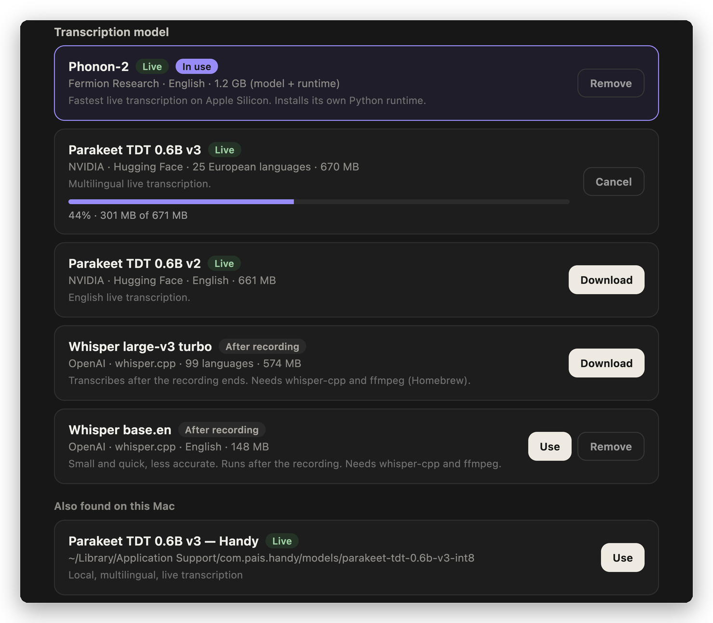

<div align="center">

# Meeting Notes

**A private menu-bar meeting recorder for macOS.**<br>
Live local transcription, named Zoom speakers, AI meeting notes, and every call saved to Notion.

[](../../releases/latest)


[Install](#install) · [Features](#features) · [Transcription models](#transcription-models) · [Notion](#save-calls-to-notion) · [Privacy](#privacy) · [Development](#development)

</div>

---

## Features

<table>
<tr><td width="30%">🎙️ <b>Live, on-device transcription</b></td><td>Phonon-2 or Parakeet transcribe while you talk, entirely on your Mac. Download models with one click.</td></tr>
<tr><td width="30%">👥 <b>Real speaker names</b></td><td>Your mic is labelled with your name. Other people are named from Zoom's active-speaker indicator, and never guessed.</td></tr>
<tr><td width="30%">📝 <b>Notes as the call unfolds</b></td><td>A running summary, decisions and action items with owners, generated through any OpenRouter model.</td></tr>
<tr><td width="30%">📹 <b>Zoom auto-record</b></td><td>Starts when a Zoom meeting begins and stops when it ends, including across screen shares and brief reconnects.</td></tr>
<tr><td width="30%">🗂️ <b>Save to Notion</b></td><td>Every call becomes a page in a Notion database, with Date, Duration, Source and action-item properties.</td></tr>
<tr><td width="30%">🔒 <b>Local by default</b></td><td>Audio and Markdown notes stay in a folder you choose. No accounts, telemetry or analytics.</td></tr>
</table>

## Install

> **Requires** an Apple Silicon Mac on macOS 14.4 or later.

1. Download **`Meeting-Notes-<version>-arm64.dmg`** from the [latest release](../../releases/latest) and drag **Meeting Notes** into Applications.
2. The app is signed with a Developer ID but **not notarized**. The first time you open it, right-click **Meeting Notes** in Applications, choose **Open**, then **Open** again.
   <sub>If macOS still refuses: `xattr -dr com.apple.quarantine "/Applications/Meeting Notes.app"`</sub>
3. Grant **Microphone** and **Screen & System Audio Recording** when asked. Grant **Accessibility** as well if you want named Zoom speakers.
4. Open **Settings → Transcription model**, click **Download** on a model, then **Use**. Phonon-2 is recommended for English and installs everything it needs.
5. Add an [OpenRouter](https://openrouter.ai) API key in **Settings** for meeting notes. To save calls to Notion too, see [Save calls to Notion](#save-calls-to-notion).

## How it works

1. **Start recording**, or let it start on its own when a Zoom meeting begins. `MN` sits in the menu bar while it runs.
2. Your microphone and the Mac's system audio are recorded together. They're transcribed separately, so your words are always labelled with your name.
3. Live notes refresh during the call. When it ends, Meeting Notes writes `YYYY-MM-DD-HHMM.md` (summary, decisions, action items and the full transcript) next to the `.webm` audio, then saves a copy to Notion if you've enabled it.

## Transcription models

Pick a model in **Settings → Transcription model**. Each card has **Download**, **Use** and **Remove** buttons. A download shows a progress bar, can be cancelled, and resumes where it stopped. The menu bar's **Transcription Model** submenu switches between installed models.

| Model | Languages | When | Size |
|---|---|---|---|
| **Phonon-2** | English | Live | ~1.2 GB* |
| Parakeet TDT 0.6B v3 | 25 European | Live | 670 MB |
| Parakeet TDT 0.6B v2 | English | Live | 661 MB |
| Whisper large-v3 turbo | 99 | After call | 574 MB |
| Whisper base.en | English | After call | 148 MB |

<sub>* Including its Python runtime. Whisper models also need `brew install whisper-cpp ffmpeg`.</sub>

**Phonon-2** from [Fermion Research](https://www.fermionresearch.com/research/phonon-2/) is a 164 MB compressed Parakeet TDT model that runs on the Apple Silicon GPU with MLX. It loads in about 12 s, then transcribes each speech segment in under 0.1 s.

<p align="center"></p>

<details>
<summary><b>Download and install details</b></summary>

- Hugging Face models (`istupakov/parakeet-tdt-0.6b-v3-onnx`, `istupakov/parakeet-tdt-0.6b-v2-onnx`, `ggerganov/whisper.cpp`) are pinned to a commit and checked against SHA-256 hashes. They're moved into `~/Library/Application Support/MeetingNotes/models` only once complete.
- Phonon-2 installs itself. A pinned standalone `uv` (downloaded if you don't have it) provides Python 3.13 and the `fermion-research` runtime in `~/Library/Application Support/MeetingNotes/phonon-venv`. While recording, the app runs `fermion serve phonon-2` on a private Unix socket.
- Models installed another way are detected too:
  - a `fermion` CLI set with `FERMION_BIN`;
  - Parakeet folders from the Handy app;
  - whisper.cpp models set with `WHISPER_MODEL` or in standard locations.
- Optional Groq or OpenAI Whisper keys in `.env` enable cloud transcription after the call. Leave them out to keep transcription local.

</details>

## Save calls to Notion

After each call's note is saved locally, Meeting Notes adds it as a page in a Notion database. The page has the summary, decisions, action items (as checkboxes) and the full speaker-labelled transcript. It also gets these properties: **Date**, **Duration (min)**, **Source** (Manual or Zoom auto), **Action items**, **Transcription** and **Summary model**.

```sh
# 1. Install and log in to the Notion CLI
brew install notion-cli && ntn login

# 2. Create the database (prints its data source ID)
scripts/create-notion-database.sh <parent-page-id>
```

3. In **Settings → Notion**, turn on **Save each call to Notion** and paste the data source ID.

Each page is created in a single request, so a failed save never leaves a half-written page. A local ledger prevents duplicates and queues failed saves, which are retried when the app starts and after the next call.

## Zoom automation

<details>
<summary><b>Auto-record behaviour</b></summary>

- Automatic recording is opt-in (**Settings → Zoom automation**).
- It starts 2.5 seconds after Zoom shows an active meeting with at least one participant.
- Screen sharing counts as the same meeting, even while Zoom hides its normal meeting window.
- Recording stops only after the meeting window and sharing controls have both been gone for 5 seconds. Screen-share transitions and brief reconnects stay in one recording.
- Zoom can only stop a recording it started. Recordings you start manually never stop when Zoom closes.
- Pressing **Stop recording** during an automatic recording pauses automation until that meeting ends.

</details>

<details>
<summary><b>Speaker names and audio routing</b></summary>

- **Your speech:** the input named `Microphone` by default. Set `MICROPHONE_LABEL` in `.env` to use another input.
- **Everyone else:** system audio captured through ScreenCaptureKit (`SYSTEM_AUDIO_LABEL` in `.env`).
- **Naming other speakers:** a small native observer reads Zoom participant names and the active-speaker indicator from the macOS Accessibility tree. A segment is named only when one Zoom speaker clearly dominates it. Otherwise it stays `Remote speaker`.
- **Zoom window:** it can sit behind other apps, but the meeting window must stay open.

</details>

## Permissions

| Permission | Why | Required |
|---|---|---|
| Microphone | Records your voice | Yes |
| Screen & System Audio Recording | Records other participants via system audio | Yes |
| Accessibility | Reads Zoom participant names and the active speaker (it never clicks or controls Zoom) | For named speakers |

If macOS remembers an old permission, quit Meeting Notes, toggle its entry off and on in **System Settings → Privacy & Security**, and reopen it.

## Privacy

- **Stays on your Mac:** audio, transcripts and notes are saved locally (`~/MeetingNotes` by default). Live transcription with Phonon-2, Parakeet or Whisper never leaves the Mac.
- **Leaves your Mac:**
  - the transcript text, sent to OpenRouter to generate notes;
  - the finished note, sent to Notion if you've turned that on;
  - audio, only if you configure a cloud Whisper provider.
- **Your API key** is encrypted with macOS secure storage and never sent back to the app's windows.
- **No accounts, telemetry or analytics.**

## Development

Requires macOS 14.4+, Node.js 22+, Rust/Cargo and the Xcode command-line tools.

```sh
git clone https://github.com/lucassynnott/meeting-notes.git
cd meeting-notes
npm install
npm run build:worker && npm run build:zoom-observer   # Rust Parakeet worker + Swift Zoom observer
npm start
npm test
```

`npm run dist` builds both helpers and packages a signed `dist/Meeting-Notes-<version>-arm64.dmg` and `.zip`. It signs with the first Developer ID Application identity in your keychain; set `CSC_IDENTITY_AUTO_DISCOVERY=false` to build unsigned. Configuration options are documented in [`.env.example`](.env.example).

<details>
<summary><b>Project layout</b></summary>

| Path | What it does |
|---|---|
| `src/main.js` | Electron main process: tray, windows, recording lifecycle |
| `src/renderer.js`, `src/recorder.html` | Capture, live transcript and notes UI |
| `src/model-manager.js` | Model catalog, verified downloads, Phonon-2 installer |
| `src/phonon-transcription.js`, `src/live-transcription.js` | Phonon-2 server client and Parakeet worker client |
| `src/summary.js` | OpenRouter note generation |
| `src/notion-sync.js` | Notion pages via the `ntn` CLI, with retry ledger |
| `src/zoom-accessibility.js`, `src/zoom-auto-recording.js` | Zoom speaker names and auto-record state machine |
| `native/parakeet-worker` | Rust ONNX Parakeet worker |
| `native/zoom-observer` | Swift Accessibility observer for Zoom |

</details>

## License

[MIT](LICENSE). Model weights carry their own licences: Phonon-2 and Parakeet are CC-BY-4.0, and Whisper is MIT.
